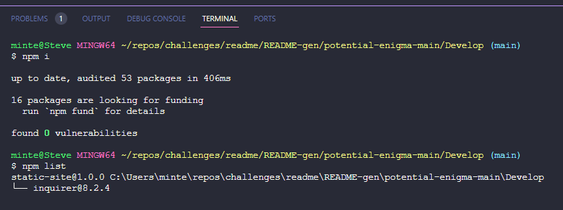

# Professional README Generator

## Description

This is a command line application that prompts users with questions that, if answered, will generate a README.md file.

## Installation

1. node.js must be installed on your machine
2. A gitignore file must be present including
   .DS_Store and node modules (these items do not need to be tracked by git)

3. Go to your Develop folder/Root Folder, right click and select open in the terminal, type the command "npi i" to install all packages
   
4. You can see a list of packages by typing the command "npm list"
   
5. Go to the index.js file and right click, select open in terminal, type command "node index.js" and press enter
   
6. You will be prompted with a series of questions, upon completion you will see a new readme has been generated.
   
